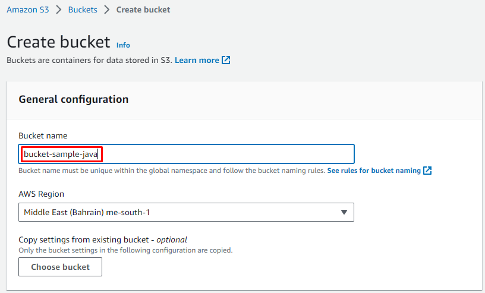
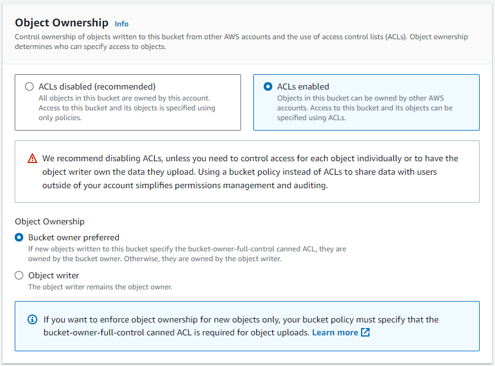
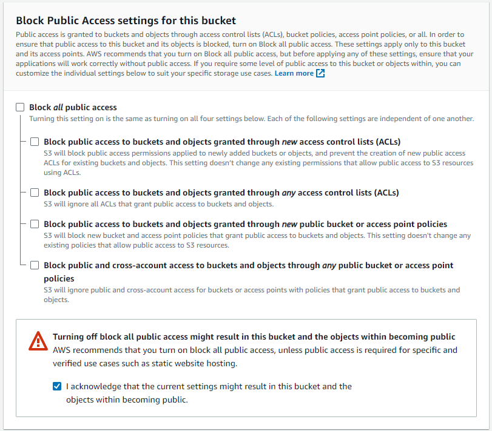
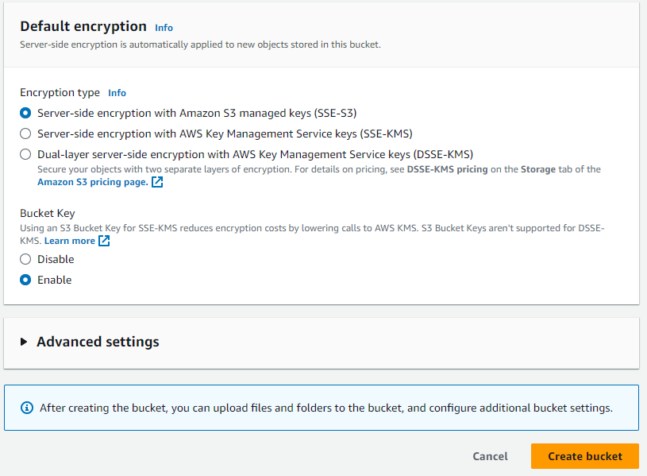
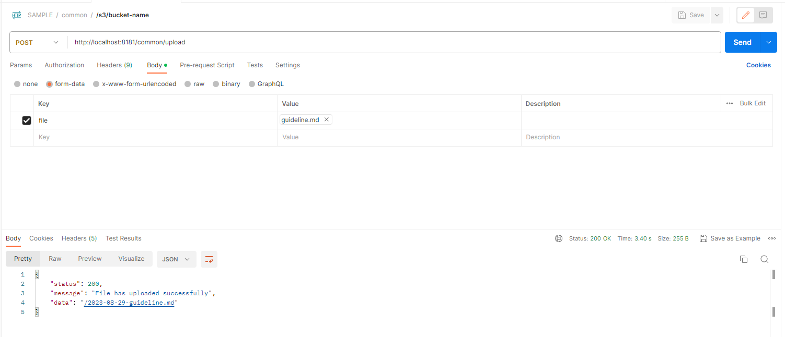

# Upload file to S3

### 1. Creating an S3 via the AWS Console
#### 1.1. General configuration


#### 1.2 Object Ownership


#### 1.3 Block Public Access settings for this bucket


#### 1.4 Default encryption



### 2. How to implement it in Java ?
#### 2.1 Add dependency
```
<dependency>
   <groupId>com.amazonaws</groupId>
   <artifactId>aws-java-sdk</artifactId>
   <version>1.11.163</version>
</dependency>
```

#### 2.2 Connect to amazon s3
```
@Configuration
@Slf4j(topic = "AMAZON-S3-CONFIG")
public class AmazonS3Config {

    @Value("${amazon.s3.region}")
    String region;
    @Value("${amazon.s3.accessKey}")
    String accessKey;
    @Value("${amazon.s3.secretKey}")
    String secretKey;

    public AWSCredentials credentials() {
        return new BasicAWSCredentials(accessKey, secretKey);
    }

    @Bean
    public AmazonS3 amazonS3() {
        return AmazonS3ClientBuilder
                .standard()
                .withCredentials(new AWSStaticCredentialsProvider(credentials()))
                .withRegion(Regions.fromName(region))
                .build();
    }
}
```

#### 2.3 Working amazon S3Client

- __Bucket-level actions:__ `com.sample.common.S3Client`

    - Create a bucket:
    ```
    public void createS3Bucket(String bucketName, boolean publicBucket) {
        if (amazonS3Client.doesBucketExistV2(bucketName)) {
            log.info("Bucket name already in use. Try another name.");
            return;
        }
        if (publicBucket) {
            amazonS3Client.createBucket(bucketName);
        } else {
            amazonS3Client.createBucket(new CreateBucketRequest(bucketName).withCannedAcl(CannedAccessControlList.Private));
        }
    }
    ```

    - List buckets:
    ```
    public List<Bucket> listBuckets() {
        return amazonS3Client.listBuckets();
    }
    ```

    - Delete a bucket:
    ```
    public void deleteBucket(String bucketName) {
        try {
            amazonS3Client.deleteBucket(bucketName);
        } catch (AmazonServiceException e) {
            log.error(e.getErrorMessage());
            return;
        }
    }
    ```

    - Put an object in a bucket:
    ```
    public String putObject(String bucketName, MultipartFile file, boolean publicObject) {
        log.info("Pushing file {} to amazon s3", file.getName());

        ObjectMetadata metadata = new ObjectMetadata();
        metadata.setContentLength(file.getSize());
        metadata.setContentType(file.getContentType());

        String key = new LocalDate() + "-" + Objects.requireNonNull(file.getOriginalFilename()).replace(" ", "_");

        try {
            PutObjectRequest putObjectRequest;
            if (publicObject) {
                putObjectRequest = new PutObjectRequest(bucketName, key, file.getInputStream(), metadata).withCannedAcl(CannedAccessControlList.PublicRead);
            } else {
                putObjectRequest = new PutObjectRequest(bucketName, key, file.getInputStream(), metadata).withCannedAcl(CannedAccessControlList.Private);
            }
            amazonS3Client.putObject(putObjectRequest);
            log.info("File {} has pushed successful", file.getName());
            return amazonS3Client.getUrl(bucketName, key).getPath();
        } catch (Exception e) {
            log.error("Pushing file was failure, message={}", e.getMessage(), e);
            throw new RuntimeException("Pushing file was failure");
        }
    }    
    ```

    - List all objects' names:
    ```
    public List<S3ObjectSummary> listObjects(String bucketName) {
        ObjectListing objectListing = amazonS3Client.listObjects(bucketName);
        return objectListing.getObjectSummaries();
    }    
    ```

    - Make a download of an object:
    ```
    public void downloadObject(String bucketName, String objectName) {
        S3Object s3object = amazonS3Client.getObject(bucketName, objectName);
        S3ObjectInputStream inputStream = s3object.getObjectContent();
        try {
            FileUtils.copyInputStreamToFile(inputStream, new File("." + File.separator + objectName));
        } catch (IOException e) {
            log.error(e.getMessage());
        }
    }    
    ```

    - Delete an object:
    ```
     public void deleteObject(String bucketName, String objectName) {
        amazonS3Client.deleteObject(bucketName, objectName);
    }   
    ```

    - Delete multiple objects:
    ```
     public void deleteMultipleObjects(String bucketName, List<String> objects) {
        DeleteObjectsRequest delObjectsRequests = new DeleteObjectsRequest(bucketName)
                .withKeys(objects.toArray(new String[0]));
        amazonS3Client.deleteObjects(delObjectsRequests);
    }   
    ```

    - Moving an object between two buckets:
    ```
     public void moveObject(String bucketSourceName, String objectName, String bucketTargetName) {
        amazonS3Client.copyObject(
                bucketSourceName,
                objectName,
                bucketTargetName,
                objectName
        );
    }   
    ```

#### 2.4 Add to CommonService
```
@Service
@Slf4j(topic = "COMMON-SERVICE")
public class CommonService {
    ...
    public String upload(MultipartFile file) {
        if (!file.isEmpty()) {
            return s3Client.putObject(bucketName, file, true);
        } else {
            throw new IllegalArgumentException("File can not blank");
        }
    }
    ...
}
```

#### 2.5 Create API upload
```
@RestController
@RequestMapping("/common")
@Slf4j(topic = "COMMON-CONTROLLER")
public record CommonController(CommonService commonService) {
    ...
    @PostMapping(path = "/upload", headers = apiKey)
    public SuccessResponse upload(@RequestParam("file") MultipartFile file) {
        log.info("Request GET /common/upload");

        try {
            String response = commonService.upload(file);
            return new SuccessResponse(OK, "File has uploaded successfully", response);
        } catch (IllegalArgumentException e) {
            log.error("Uploading file was failure, message={}", e.getMessage(), e);
            return new FailureResponse(BAD_REQUEST, e.getMessage());
        }
    }
    ...
}
```

#### 2.6 Test by postman


---
***Source code:*** [GitHub](https://github.com/Kien-fit/java-sample/tree/upload-file-to-s3)

***Reference sources:***
 - [Spring Boot with AWS S3 Bucket from zero to useful](https://medium.com/javarevisited/spring-boot-with-aws-s3-bucket-from-zero-to-useful-c0895ab26aaa)
